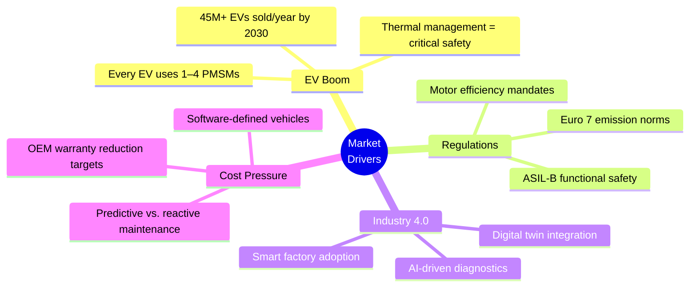
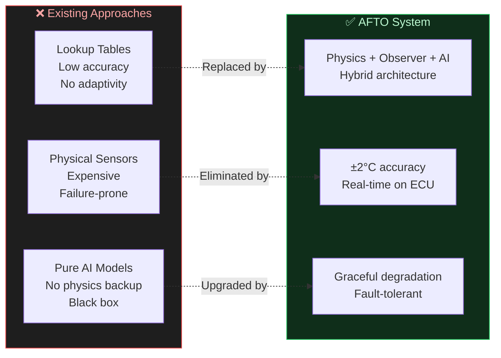
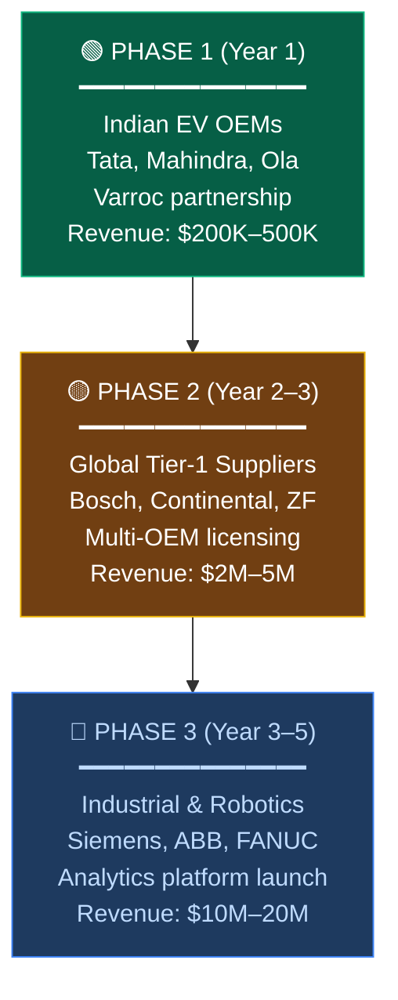
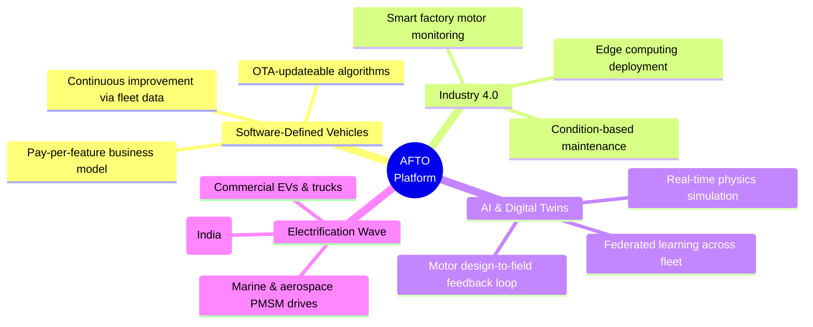

# 💼 Business Potential — AFTO System

### Real-Time PMSM Magnet Temperature Estimation (Physics + Observer + AI)

---
---

# 🟦 SECTION 1 — Market Opportunity

> **A $500B+ EV revolution — and every motor needs thermal intelligence.**

---

## 📊 Infographic: Market Opportunity

---

## Key Market Numbers

| Market Segment | Current Size | Projected Size | CAGR |
|:---|:---:|:---:|:---:|
| 🚗 **Global EV Market** | **$500B+** (2025) | **$1.3T+** (2030) | **17–32%** |
| ⚡ **PMSM Motor Market** | **$15B** (2024) | **$26–42B** (2032) | **7.5–8.3%** |
| 🔧 **Predictive Maintenance** | **$10B** (2025) | **$36B+** (2030) | **25–30%** |
| 🌐 **Automotive Digital Twin** | **$2.5B** (2025) | **$18B** (2032) | **30–48%** |

---

## 🚀 Growth Drivers

---

> 🔑 **Insight:** Every EV produced needs magnet thermal protection. With **45M+ EVs/year by 2030**, the addressable market for our solution scales linearly with EV production.

---
---

# 🟩 SECTION 2 — The Industry Problem

> **$3K–$33K per motor failure. And today's thermal protection is flying blind.**

---

## 📊 Infographic: The Industry Problem

---

## ❌ The Gap in Today's EVs

| Problem | Impact | Current "Solution" |
|:---|:---|:---|
| ⚠️ **No physical magnet temp sensor** | Magnet temperature is unknown in real-time | Conservative derating → **wastes 10–15% peak power** |
| 🔥 **Demagnetization risk** | Permanent magnet damage at >150°C — irreversible | Over-engineered thermal margin → **higher motor cost** |
| 💰 **Motor replacement cost** | **$3,000 – $33,000** per drive unit failure | Reactive warranty claims → **unpredictable OEM cost** |
| 📉 **No predictive capability** | Failures detected only after they happen | No data → **no fleet-level learning** |

---

## 💡 Why a Physical Sensor Doesn't Work

* 🌡️ Magnet sits on a **spinning rotor** — wiring a sensor is impractical
* 🔥 Extreme temperatures (**120–180°C**) — most sensors degrade
* 💸 Adding sensors increases BOM cost by **$8–15/motor** at volume
* ⚡ Slip rings / wireless sensors add **failure points & complexity**

> 👉 **The industry needs a software-only virtual sensor — that's exactly what AFTO delivers.**

---
---

# 🟥 SECTION 3 — Our Business Value

> **Software-only. Zero hardware cost. Drop-in integration.**

---

## 📊 Infographic: Business Value Proposition

---

## ✅ Value Delivered to OEMs

| Value Metric | Without AFTO | With AFTO | Improvement |
|:---|:---:|:---:|:---:|
| **Magnet Temp Accuracy** | ±15–25 °C (lookup table) | **±2 °C** (hybrid observer) | **8–12× better** |
| **Peak Power Utilization** | 85–90% (conservative derating) | **97–100%** (precise derating) | **+10–15%** |
| **Motor Failure Rate** | Baseline | **↓ 40–60%** | Significant |
| **Warranty Cost per Vehicle** | $50–200 (motor-related) | **$20–80** | **↓ 40–60%** |
| **Additional Hardware Cost** | $8–15/motor (if sensor added) | **$0** | **100% savings** |
| **Time to Detect Overtemp** | 5–10 seconds | **< 1 second** | **5–10× faster** |

---

## 🏗️ Competitive Advantage

---
---

# 🟨 SECTION 4 — Target Customers

> **From EV OEMs to industrial robotics — every PMSM is a customer.**

---

## 🎯 Customer Segments

| Segment | Key Players | Pain Point | Our Fit |
|:---|:---|:---|:---|
| 🚗 **EV OEMs** | Tata Motors, Mahindra, Hyundai, BMW, Tesla, BYD | Motor thermal protection without expensive sensors | Primary customer — per-vehicle license |
| 🏭 **Tier-1 Suppliers** | Varroc, Bosch, Continental, ZF, Nidec | Need embedded thermal estimation in inverter/MCU | Integration partner — co-development |
| ⚙️ **Industrial Motor Mfrs** | Siemens, ABB, WEG, Regal Rexnord | Process motor overheating in continuous duty | Industrial license — analytics platform |
| 🤖 **Robotics & Automation** | FANUC, KUKA, Yaskawa, ABB Robotics | Servo motor thermal limits in high-duty cycles | Embedded SDK — per-unit license |

---

## 📈 Market Entry Strategy

---
---

# 🟪 SECTION 5 — Future Market Potential

> **From virtual sensor to full motor digital twin — the platform play.**

---

## 🔮 Expansion Roadmap

| Timeframe | Opportunity | Market Size | Our Position |
|:---|:---|:---:|:---|
| **Now** | Magnet temperature estimation | $15B (PMSM) | ✅ Core product — first mover |
| **2027** | Full motor thermal digital twin | $18B (Digital Twin) | 🔄 Extend physics model to all motor components |
| **2028** | Fleet-level predictive analytics | $36B (PdM) | 📊 OTA data aggregation + cloud dashboard |
| **2030** | AI-driven motor design optimization | $50B+ (Simulation) | 🤖 Feed field data back into next-gen motor design |

---

## 🌐 Convergence with Mega-Trends

---
---

# 🟫 SECTION 6 — Revenue Model

> **Three revenue streams. Volume + Services + Recurring.**

---

## 📊 Infographic: Revenue Model & Target Customers

---

## 💰 Revenue Architecture

| Stream | Model | Price Point | Scale Driver |
|:---|:---|:---:|:---|
| 📦 **Software License** | Per-vehicle royalty | **$2–5 / vehicle** | Scales with EV production volume |
| 🔧 **Integration Services** | Per-program NRE | **$50K–200K / OEM program** | One-time per platform |
| 📊 **Analytics Subscription** | Per-vehicle/year SaaS | **$0.50–1.00 / vehicle / year** | Recurring — grows with fleet size |
| 🎓 **Calibration Toolkit** | Annual license | **$10K–50K / year** | For Tier-1 engineering teams |

---

## 📈 Revenue Projection (Conservative)

| Year | Vehicles Licensed | License Revenue | Services | Subscription | **Total** |
|:---:|:---:|:---:|:---:|:---:|:---:|
| **Y1** | 50K | $150K | $300K | — | **$450K** |
| **Y2** | 300K | $900K | $600K | $150K | **$1.65M** |
| **Y3** | 1M | $3M | $800K | $450K | **$4.25M** |
| **Y5** | 5M | $15M | $1.5M | $3M | **$19.5M** |

---

## 💎 Unit Economics

| Metric | Value |
|:---|:---:|
| **Cost to serve (per vehicle)** | ~$0.10 (marginal — software only) |
| **Gross margin** | **95%+** |
| **Customer acquisition** | Through Tier-1 partnerships (Varroc, Bosch) |
| **Switching cost** | High — calibrated to specific motor platform |
| **Moat** | Physics IP + trained AI + calibration data |

---

> 🔑 **Key Insight:** This is a **software-only product with 95%+ gross margin** that scales linearly with EV production. No factory, no inventory, no hardware BOM.

---
---

## 🏆 Summary — Why This Is a Billion-Dollar Opportunity

| Dimension | Our Strength |
|:---|:---|
| 📊 **Market** | $500B+ EV market → every PMSM needs thermal protection |
| 🔬 **Technology** | Only hybrid Physics + Observer + AI solution with ±2°C accuracy |
| 💰 **Economics** | Software-only, 95%+ margin, zero hardware cost to customer |
| 🎯 **Customers** | Immediate demand from EV OEMs, Tier-1s, industrial motor makers |
| 🚀 **Scalability** | Per-vehicle software license → scales with global EV production |
| 🛡️ **Moat** | Physics IP + embedded optimization + calibration data = high switching cost |

---

> **"We're not selling a sensor. We're selling motor intelligence — and every EV on Earth needs it."**

---

*Eureka Case Challenge — AFTO System | Business Potential v1.0*
