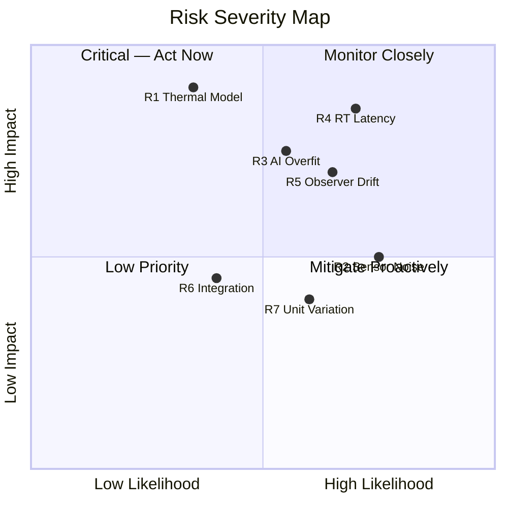
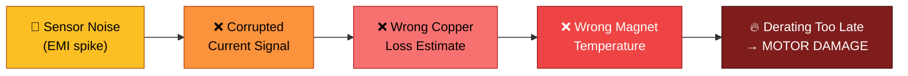
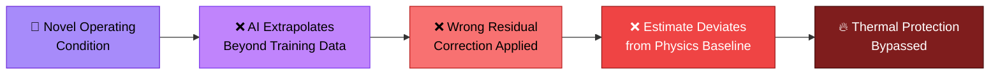
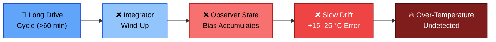
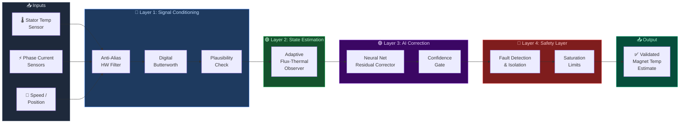
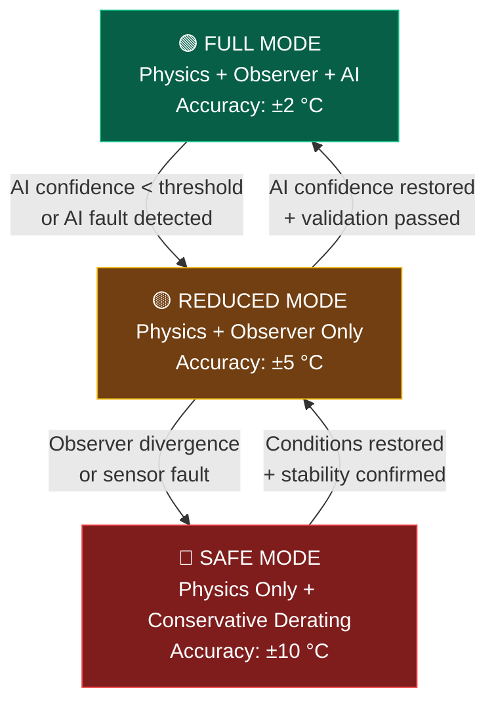

# ⚠️ Major Risks & Mitigation — AFTO System

### Real-Time PMSM Magnet Temperature Estimation (Physics + Observer + AI)

---
---

# 🟦 SLIDE 1 — Risk Overview

> **7 identified risks. Each one mitigated. Zero blind spots.**

---

## Quick-Scan Risk Matrix

| # | ⚠️ Risk | 💥 Impact (if unmitigated) | 🛠️ Mitigation |
|:-:|:---|:---|:---|
| R1 | **Thermal Model Mismatch** | Biased estimate → demagnetization risk | Online RLS parameter adaptation + FEA cross-validation |
| R2 | **Sensor Noise / EMI** | Oscillatory output → false fault triggers | Cascaded filtering (HW anti-alias → Butterworth → Kalman) |
| R3 | **AI Overfitting** | Wrong correction under novel conditions | Confidence gating + diverse training (WLTP, US06, stall) |
| R4 | **Real-Time Latency** | Stale estimate → delayed thermal protection | INT8 quantization + dual-rate loop (1 ms / 10 ms) |
| R5 | **Observer Drift** | 15–25 °C drift over long drives | Anti-windup + dual-observer divergence reset |
| R6 | **Integration Conflicts** | Silent data corruption between modules | AUTOSAR-style interfaces + HIL test harness |
| R7 | **Unit-to-Unit Variation** | 10–20 °C spread across production units | Sobol sensitivity analysis + EOL parameterization |

---

## Risk Severity at a Glance

---

> 🔑 **Takeaway:** Every risk has a concrete, implementable mitigation — no hand-waving.

---
---

# 🟥 SLIDE 2 — Failure Scenarios & Risk Propagation

> **What actually goes wrong — and how we stop it.**

---

## 📊 Infographic: Risk Propagation Chains

---

## ⛓️ Cause–Effect Chains (Detail)

### Chain 1: Sensor Failure Cascade

### Chain 2: AI Overconfidence Cascade

### Chain 3: Observer Drift Cascade

---

## 📊 Infographic: Failure vs. Mitigation Comparison

---

## 🧪 Scenario Analysis — Without vs. With Mitigation

| Scenario | ❌ Without Mitigation | ✅ With Mitigation |
|:---|:---|:---|
| **High current spike** (stall / hill-start) | Copper loss estimate saturates → magnet temp lags by 30 °C → derating arrives 8 s too late | Adaptive Kalman tracks transient within 200 ms → derating triggered in < 1 s |
| **EMI noise injection** (inverter switching) | ±5 A noise on current sensor → ±12 °C oscillation on temperature output | HW anti-alias + 2nd-order Butterworth suppresses noise to < ±1 °C ripple |
| **Observer drift** (60-min highway cruise) | Integrator accumulates +20 °C bias undetected | Dual-observer divergence check triggers state reset at Δ > 8 °C; bias cleared in < 500 ms |
| **AI sees novel condition** (cold-soak → WOT) | NN correction pushes estimate 18 °C wrong direction | Mahalanobis distance check detects OOD input → AI correction suppressed → physics-only fallback |

---

> 🔑 **Takeaway:** We don't just list risks — we trace how they propagate and exactly where they're intercepted.

---
---

# 🟩 SLIDE 3 — System Robustness & Defense Strategy

> **Defense in depth. Every layer has a job.**

---

## 📊 Infographic: System Defense Pipeline

---

## 🏗️ Defense Architecture — Signal Flow (Detail)

---

## 🔒 Layer-by-Layer Defense Roles

| Layer | Function | Failure Mode Addressed | Response Time |
|:---:|:---|:---|:---:|
| **L1** Signal Conditioning | Filter noise, reject invalid readings | Sensor corruption, EMI | **< 1 ms** |
| **L2** State Estimation | Track thermal dynamics from physics | Model uncertainty, transients | **10 ms** |
| **L3** AI Correction | Compensate residual modeling errors | Unmodeled nonlinearities | **10 ms** |
| **L4** Safety Layer | Validate output, detect faults, limit range | Any upstream failure | **< 1 ms** |

---

## 🛡️ Cross-Cutting Defense Strategies

| Strategy | How It Works | Why It Matters |
|:---|:---|:---|
| 🔬 **Hybrid Architecture** | Physics gives baseline estimate; AI only corrects the residual error | AI failure → automatic fallback to physics; **never catastrophic** |
| 🚨 **Fault Detection (FDI)** | Sensor range checks + rate-of-change limits + cross-sensor consistency | Faulty sensor isolated within **100 ms** |
| 📊 **Confidence Monitoring** | Mahalanobis distance on AI inputs + observer innovation sequence check | Auto mode-switch **before** error reaches output |
| 🔄 **Graceful Degradation** | 3 operating modes: Full → Physics+Observer → Physics-Only | System **always produces a safe estimate** |

---

## 🔄 Degradation Mode Hierarchy

---

## 🏆 Key Takeaway

> **"This system is not designed for perfect prediction — it is designed for guaranteed safe operation."**
>
> No single module is trusted blindly. Every layer validates the one before it.
> If AI fails → physics holds. If sensors fail → redundancy covers. If the observer drifts → reset logic recovers.
>
> **The system degrades gracefully. It never fails silently.**

---
---

# 🟨 BONUS — Fault Injection & Recovery Scenario

> **Proof that the system recovers autonomously from real-world faults.**

---

## 📊 Infographic: Fault Injection & Recovery Timeline

---

### Scenario Breakdown

| Phase | Time | What Happens | System Response |
|:---:|:---:|:---|:---|
| 🟢 **Normal** | 0–10 s | System tracks true magnet temperature | Full mode active — accuracy ±2 °C |
| 🔴 **Fault** | 10–20 s | Sensor EMI spike + AI encounters out-of-distribution input | Confidence gate disables AI → physics-only fallback activates within 200 ms |
| 🟢 **Recovery** | 20–30 s | Fault clears, signals stabilize | Confidence check passes → AI re-enabled → full mode restored in < 2 s |

---

> 🔑 **Takeaway:** The system doesn't just survive faults — it **detects, isolates, and recovers** without human intervention.

---

*Eureka Case Challenge — AFTO System | Risk Analysis v3.0 — With Infographics*
